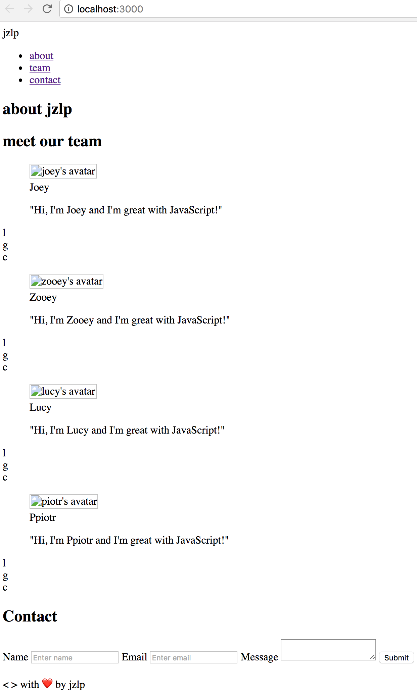
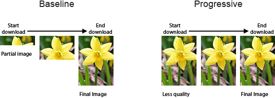

# JZLP Week one project
---

## Why

  fill

## What

  us

## How

  in

### Process
1. discussion day 1
  * set up github repo and gitter channel
  * group wireframe of web app
  * decided to go mobile first in terms of design
  * ran through user stories to check that our plan fitted these
    * decided to use formspree.io for form
    * looking at colorsafe to make sure we fulfil partially sighted readers needs
    * straight up semantic html to aid accessability. no divs.
      * use aria landmarks as well as html5 elements to ensure accessability
      * set autocomplete tags to complete forms
      * make sure all is tabbable
    * do we need any javascript?
      * hopefully not
  * Day one target: have a basic web app with placeholders by the end of today

### Tasks
- [x] html structure assigned to Piotr and Lucy

  

- [x] work out host on github pages
- [x] inital design (enhanced wireframe) assigned to Joey and Zooey

### Stretch goals
- [x] convert profile photos to cartoon using [BeFunky Online Photo Editor](https://www.befunky.com/)
- [x] optimise rendering of images
  1. Reduced file size of profile images (11MB -> 70K) by resizing and optimising.
  1. Saved JPEGs as **progressive images rather than baseline images**. Baseline images are the "normal" JPEGs, the type of JPEG that all image programs write by default. The browsers load them top-to-bottom as more of the image information is being downloaded. Progressive JPEGs are another type of JPEGs, they are rendered progressively. First you see a low quality version of the whole image. Then, as more of the image information arrives over the network, the quality gradually improves.

  

  Resources:
   - [GIMP - How to save in progressive / baseline mode - Youtube](https://www.youtube.com/watch?v=SadyOSO3D8w)
   - [Photoshop - How to save in progressive / baseline mode](http://peteschuster.com/2013/01/saving-jpegs-for-the-web-setting-photoshop-up-for-progressive-jpegs/)
   - [Progressive vs Baseling - Demo Image - Youtube](https://www.youtube.com/watch?v=TOc15-2apY0)
   - [Progressive vs Baseling - Demo Page - Youtube](https://www.youtube.com/watch?v=oItMsmZ995I)
   - [Book of Speed - Chapter 5 Optimizing Images - Stoyan Stefanov](http://www.bookofspeed.com/chapter5.html)
   - [Progressive jpegs: a new best practice](https://calendar.perfplanet.com/2012/progressive-jpegs-a-new-best-practice/)
   - [The return of the progressive JPEG](https://www.wired.com/2013/01/the-return-of-the-progressive-jpeg/)

- [ ] ~~expand "team" member sections on hover~~

  

- [ ] smooth jump to section (can it be done with css? go with js if needed)
- [ ] improve security of form submission
- [x] make each section fill screen

### User stories
### Build a one-page portfolio website for you and your team

We want you to work together over the next few days to build a small site from scratch that provides a short portfolio for you and your team.

To describe what features should be implemented, these are the [user stories](https://en.wikipedia.org/wiki/User_story) that should be satisfied;

As a **client looking to hire a team of developers**
> I want to **visit your site and immediately see a headline about your team**

> So that I **get a concise description of what you have to offer me**.

As a **client looking to hire a team of developers**
> I want to **visit your site and see a navigation link for 'About, Team, and Contact'**

> so I can **quickly navigate to the areas of the site I'd like to visit.**

As a **client looking to hire a team of developers**
> I want to **be able to contact the developers by filling out and submitting a form by providing my name, email and message information**

> So that **the team have sufficient information to contact me afterwards**

As a **client looking to hire a team of developers**
> I want to **click on a navigation link and a corresponding section be made visible in the browser window on the same page**

> So that I **can quickly navigate around the site without having to wait for new pages to be loaded.**

As a **client looking to hire a team of developers**
> I want to **easily view the site when browsing on my mobile, tablet or desktop**

> so that I **can understand the sites content easily on whatever device I choose to view it in.**

As a **visually impaired client...**

> I would like to **easily read and understand the text on your site**

> so I can **understand the information available**

As a **blind client...**
> I would like to **easily understand how to navigate the site after my screen reader reads me the content of the site**

> so I can **understand the information available**.

As a **client with JavaScript disabled in their browser for security reasons**
>  I would like **to visit your site and get a similar experience to viewing your site on a modern browser with JavaScript enabled**

> so that I **don't feel like I'm completely in the stone age**.
